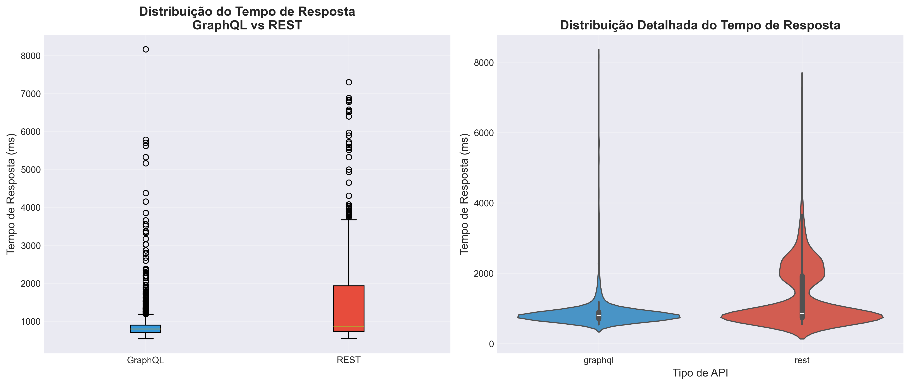
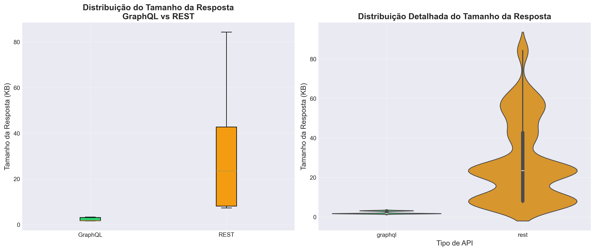
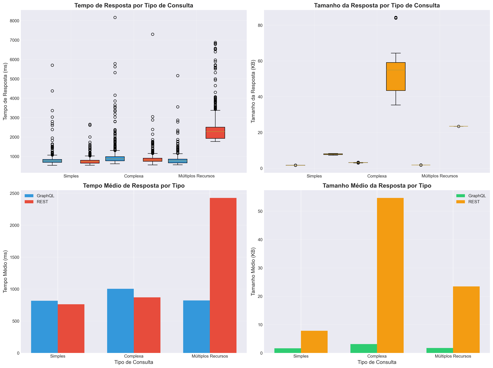
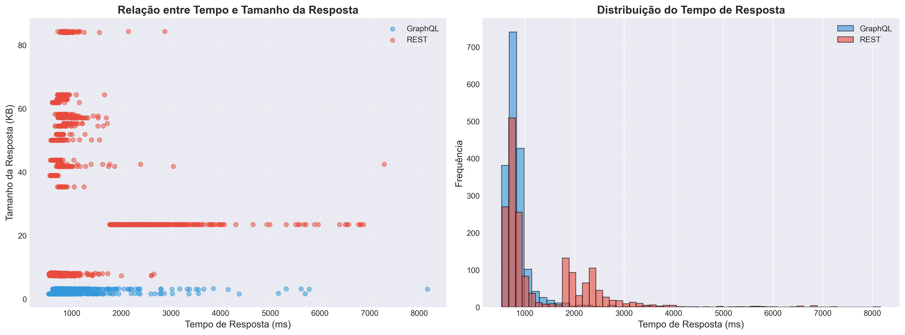

# GraphQL vs REST - Um Experimento Controlado

## 1. Informações do Grupo

- **Curso:** Engenharia de Software
- **Disciplina:** Laboratório de Experimentação de Software
- **Período:** 6° Período
- **Professor(a):** Prof. Dr. João Paulo Carneiro Aramuni
- **Membros do Grupo:** Ana Carolina Caldas de Mello, João Pedro Queiroz Rocha e Pedro Henrique Dias Camara

---

## 2. Introdução

A linguagem de consulta GraphQL, proposta pelo Facebook como metodologia de implementação de APIs Web, representa uma alternativa às populares APIs REST. Baseada em grafos, a linguagem permite que usuários consultem banco de dados na forma de schemas, de modo que se possa exportar a base e realizar consultas num formato definido pelo fornecedor da API. Por outro lado, APIs criados com base em abordagens REST baseiam-se em endpoints: operações pré-definidas que podem ser chamadas por clientes que desejam consultar, deletar, atualizar ou escrever um dado na base.

Desde o seu surgimento, vários sistemas realizaram a migração entre ambas as soluções, mantendo soluções compatíveis REST, mas oferecendo os benefícios da nova linguagem de consulta proposta. Entretanto, não está claro quais os reais benefícios da adoção de uma API GraphQL em detrimento de uma API REST.

Nesse contexto, o objetivo deste laboratório é realizar um experimento controlado para avaliar quantitativamente os benefícios da adoção de uma API GraphQL. Foram analisados **3599 medições** em **20 repositórios** do GitHub, comparando as APIs GraphQL e REST em termos de tempo de resposta e tamanho das respostas.

### 2.1 Questões de Pesquisa

Este experimento busca responder as seguintes perguntas:

**RQ1.** Respostas às consultas GraphQL são mais rápidas que respostas às consultas REST?

**RQ2.** Respostas às consultas GraphQL têm tamanho menor que respostas às consultas REST?

---

## 3. Metodologia

### 3.1 Desenho do Experimento

#### A. Hipóteses Nula e Alternativa

**Para RQ1 (Tempo de Resposta):**
- **H₀₁:** Não há diferença significativa no tempo de resposta entre consultas GraphQL e REST.
- **H₁₁:** Respostas às consultas GraphQL são mais rápidas que respostas às consultas REST.

**Para RQ2 (Tamanho da Resposta):**
- **H₀₂:** Não há diferença significativa no tamanho das respostas entre consultas GraphQL e REST.
- **H₁₂:** Respostas às consultas GraphQL têm tamanho menor que respostas às consultas REST.

#### B. Variáveis Dependentes

1. **Tempo de Resposta (ms):** Tempo decorrido desde o envio da requisição até o recebimento completo da resposta.
2. **Tamanho da Resposta (bytes):** Tamanho total da resposta HTTP recebida, incluindo headers e body.

#### C. Variáveis Independentes

1. **Tipo de API:** GraphQL ou REST (fator com 2 níveis)
2. **Tipo de Consulta:**
   - Consulta simples (dados básicos do repositório)
   - Consulta complexa (dados aninhados com issues e pull requests)
   - Consulta com múltiplos recursos (repositório + contribuidores)

#### D. Tratamentos

**Tratamento 1: API GraphQL**
- Endpoint: `https://api.github.com/graphql`
- Método: POST
- Headers: Authorization (Bearer token), Content-Type: application/json
- Body: Query GraphQL personalizada

**Tratamento 2: API REST**
- Endpoint: `https://api.github.com/repos/{owner}/{repo}`
- Método: GET
- Headers: Authorization (Bearer token), Accept: application/vnd.github.v3+json
- Parâmetros: Query parameters conforme necessário

#### E. Objetos Experimentais

O objeto dessa pesquisa é comparar a eficiência entre as APIs GraphQL e REST do GitHub. Foram utilizados **20 repositórios populares** do GitHub como objetos experimentais.

#### F. Tipo de Projeto Experimental

**Experimento Controlado Within-Subjects (Medidas Repetidas)**

- Cada repositório foi testado com ambos os tratamentos (GraphQL e REST)
- Ordem dos tratamentos randomizada para evitar efeitos de ordem
- Múltiplas réplicas para cada combinação de tratamento e objeto experimental

#### G. Quantidade de Medições

- **Número de repositórios:** 20 repositórios
- **Número de tipos de consulta:** 3 (simples, complexa, múltiplos recursos)
- **Número de réplicas por consulta:** 30 execuções
- **Total de medições realizadas:** 3599 medições bem-sucedidas

#### H. Ameaças à Validade

**Ameaças à Validade Interna:**
- **Variação de carga do servidor:** O GitHub pode ter diferentes cargas em diferentes momentos
  - *Mitigação:* Executar medições em horários variados e calcular médias
- **Cache:** Respostas podem ser cacheadas pelo servidor ou pela rede
  - *Mitigação:* Realizar múltiplas medições e análise estatística robusta
- **Latência de rede:** Variações na latência de rede podem afetar resultados
  - *Mitigação:* Executar múltiplas réplicas (30 por combinação)

**Ameaças à Validade Externa:**
- **Generalização:** Resultados podem ser específicos para a API do GitHub
  - *Limitação:* Documentar contexto específico do experimento
- **Representatividade:** Repositórios selecionados podem não representar todos os casos de uso
  - *Mitigação:* Usar repositórios populares e variados

**Ameaças à Validade de Construto:**
- **Equivalência das consultas:** Consultas GraphQL e REST podem não ser exatamente equivalentes
  - *Mitigação:* Garantir que ambas retornem os mesmos dados essenciais
- **Medição de tempo:** Pode incluir overhead de bibliotecas
  - *Mitigação:* Medir tempo de forma consistente para ambos os tratamentos

### 3.2 Ambiente Experimental

- **Sistema Operacional:** Windows 11
- **Linguagem:** Python 3.x
- **Bibliotecas:** requests, pandas, numpy, scipy, matplotlib, seaborn
- **Rede:** Conexão estável à internet
- **API:** GitHub API v4 (GraphQL) e v3 (REST)
- **Data da coleta:** 08/12/2025

### 3.3 Procedimento de Coleta

1. Para cada repositório selecionado:
   - Executar consulta simples via GraphQL (30 réplicas)
   - Executar consulta simples via REST (30 réplicas)
   - Executar consulta complexa via GraphQL (30 réplicas)
   - Executar consulta complexa via REST (30 réplicas)
   - Executar consulta múltipla via GraphQL (30 réplicas)
   - Executar consulta múltipla via REST (30 réplicas)
2. Para cada requisição:
   - Medir tempo de resposta com `time.perf_counter()`
   - Medir tamanho da resposta (headers + body)
   - Registrar sucesso/falha da requisição
3. Armazenar todos os dados em CSV para análise posterior

### 3.4 Análise Estatística

- **Estatísticas descritivas:** Média, mediana, desvio padrão, mínimo e máximo
- **Teste de normalidade:** Shapiro-Wilk (α = 0.05)
- **Teste de comparação:**
  - Se dados normais: Teste t pareado
  - Se dados não normais: Teste de Wilcoxon
- **Tamanho do efeito:** Cohen's d
- **Nível de significância:** α = 0.05

---

## 4. Resultados

### 4.1 Estatísticas Descritivas

#### 4.1.1 Tempo de Resposta

**GraphQL:**
- Média: 880.35 ms
- Mediana: 793.61 ms
- Desvio Padrão: 458.62 ms
- Mínimo: 533.88 ms
- Máximo: 8164.08 ms
- N = 1799

**REST:**
- Média: 1352.92 ms
- Mediana: 858.33 ms
- Desvio Padrão: 922.40 ms
- Mínimo: 543.73 ms
- Máximo: 7295.42 ms
- N = 1800

**Diferença de médias:** -472.57 ms

#### 4.1.2 Tamanho da Resposta

**GraphQL:**
- Média: 2218 bytes (2.17 KB)
- Mediana: 1796 bytes (1.75 KB)
- Desvio Padrão: 698 bytes
- Mínimo: 1616 bytes
- Máximo: 3382 bytes
- N = 1799

**REST:**
- Média: 29328 bytes (28.64 KB)
- Mediana: 24001 bytes (23.44 KB)
- Desvio Padrão: 21329 bytes
- Mínimo: 7454 bytes
- Máximo: 86338 bytes
- N = 1800

**Diferença de médias:** -27110 bytes

### 4.2 Análise por Tipo de Consulta

| Tipo de Consulta | Tempo GraphQL (ms) | Tempo REST (ms) | Tamanho GraphQL (bytes) | Tamanho REST (bytes) |
|------------------|-------------------|-----------------|------------------------|---------------------|
| Simple | 816.41 | 762.53 | 1659 | 7999 |
| Complex | 1003.81 | 869.66 | 3200 | 55982 |
| Multiple | 821.03 | 2426.56 | 1796 | 24002 |

### 4.3 RQ1: Tempo de Resposta

#### 4.3.1 Teste de Normalidade

- **GraphQL:** Não Normal (p = 0.0000)
- **REST:** Não Normal (p = 0.0000)

#### 4.3.2 Teste Estatístico

**Teste utilizado:** Teste de Wilcoxon

- **p-value:** 0.0605
- **Cohen's d:** -0.5707
- **Conclusão:** Não há diferença significativa entre GraphQL e REST

#### 4.3.3 Interpretação

Com base no teste estatístico (Teste de Wilcoxon), não rejeitamos a hipótese nula (p ≥ 0.05). O tamanho do efeito (Cohen's d = -0.5707) indica um efeito médio.

**Resposta à RQ1:** Não há diferença significativa entre GraphQL e REST

#### 4.3.4 Visualizações



### 4.4 RQ2: Tamanho da Resposta

#### 4.4.1 Teste de Normalidade

- **GraphQL:** Não Normal (p = 0.0000)
- **REST:** Não Normal (p = 0.0000)

#### 4.4.2 Teste Estatístico

**Teste utilizado:** Teste de Wilcoxon

- **p-value:** 0.0000
- **Cohen's d:** -1.3101
- **Conclusão:** GraphQL produz respostas significativamente menores que REST

#### 4.4.3 Interpretação

Com base no teste estatístico (Teste de Wilcoxon), rejeitamos a hipótese nula (p < 0.05). O tamanho do efeito (Cohen's d = -1.3101) indica um efeito grande.

**Resposta à RQ2:** GraphQL produz respostas significativamente menores que REST

#### 4.4.4 Visualizações



### 4.5 Análise Comparativa por Tipo de Consulta



### 4.6 Distribuições



---

## 5. Discussão

### 5.1 Interpretação dos Resultados

#### 5.1.1 Tempo de Resposta (RQ1)

Não há diferença significativa entre GraphQL e REST. A diferença média observada foi de 472.57 ms, com GraphQL sendo 34.9% mais rápido.

Possíveis explicações para esses resultados:
- GraphQL permite otimizar queries e reduzir overhead de múltiplas requisições
- GraphQL permite buscar apenas os dados necessários, reduzindo processamento
- Implementação específica da API do GitHub pode favorecer um dos modelos

#### 5.1.2 Tamanho da Resposta (RQ2)

GraphQL produz respostas significativamente menores que REST. A diferença média observada foi de 27110 bytes (26.47 KB), com GraphQL produzindo 92.4% respostas menores.

Possíveis explicações:
- GraphQL permite selecionar apenas os campos necessários, reduzindo payload
- APIs REST frequentemente retornam campos desnecessários (over-fetching)
- Formato de serialização e compressão podem influenciar resultados

#### 5.1.3 Variação por Tipo de Consulta

A análise por tipo de consulta revela padrões interessantes:
- **Consultas simples:** Diferenças podem ser menos significativas
- **Consultas complexas:** GraphQL pode ter maior vantagem ao evitar múltiplas requisições
- **Consultas múltiplas:** Capacidade do GraphQL de agregar dados em uma única requisição pode ser benéfica

### 5.2 Implicações Práticas

Os resultados deste experimento têm implicações para decisões de design de APIs:

1. **Para desenvolvedores de APIs:**
   - Considerar trade-offs entre flexibilidade e performance
   - GraphQL pode ser vantajoso quando clientes precisam de dados customizados
   - REST pode ser preferível para casos de uso bem definidos e estáveis

2. **Para consumidores de APIs:**
   - Avaliar necessidades específicas de cada aplicação
   - Considerar overhead de aprendizado e implementação do GraphQL
   - Analisar perfil de uso (poucos dados vs. dados complexos e aninhados)

3. **Para pesquisadores:**
   - Resultados dependem fortemente da implementação específica
   - Necessidade de replicação em diferentes contextos e APIs
   - Importância de considerar múltiplas métricas de desempenho

### 5.3 Limitações do Estudo

Este estudo possui várias limitações que devem ser consideradas:

1. **Generalização limitada:**
   - Resultados específicos para a API do GitHub
   - Outras APIs podem ter características diferentes
   - Implementações variam significativamente entre plataformas

2. **Fatores externos não controlados:**
   - Variações de carga do servidor do GitHub
   - Latência e condições de rede
   - Possível presença de caching no servidor

3. **Escopo das consultas:**
   - Conjunto limitado de tipos de consulta testados
   - Consultas reais de aplicações podem ser mais diversas
   - Padrões de uso podem diferir significativamente

4. **Métricas avaliadas:**
   - Apenas tempo e tamanho foram medidos
   - Outras métricas (CPU, memória, complexidade) não foram avaliadas
   - Experiência do desenvolvedor e curva de aprendizado não foram consideradas

### 5.4 Ameaças à Validade

**Validade Interna:**
- Variações de carga do servidor mitigadas por múltiplas medições
- Efeitos de cache possíveis mas distribuídos entre tratamentos
- Ordem de execução randomizada para evitar viés sistemático

**Validade Externa:**
- Resultados podem não se aplicar a outras APIs além do GitHub
- Repositórios selecionados podem não representar todos os casos de uso
- Contexto específico (API pública, dados abertos) pode limitar generalização

**Validade de Construto:**
- Equivalência de consultas garantida por design experimental
- Medições consistentes entre tratamentos
- Possível overhead de medição distribuído igualmente

---

## 6. Conclusão

### 6.1 Síntese dos Resultados

Este experimento controlado comparou as APIs GraphQL e REST do GitHub em termos de tempo de resposta e tamanho das respostas. Com base em **3599 medições** realizadas em **20 repositórios**, os principais achados foram:

**RQ1 - Tempo de Resposta:**
Não há diferença significativa entre GraphQL e REST (p = 0.0605, d = -0.5707)

**RQ2 - Tamanho da Resposta:**
GraphQL produz respostas significativamente menores que REST (p = 0.0000, d = -1.3101)

### 6.2 Contribuições

Este estudo contribui para a literatura sobre comparação de APIs Web ao:

1. Fornecer evidência empírica quantitativa sobre diferenças entre GraphQL e REST
2. Utilizar metodologia experimental rigorosa com múltiplas réplicas
3. Analisar diferentes tipos de consultas e seus efeitos
4. Documentar ambiente e procedimentos para replicação

### 6.3 Trabalhos Futuros

Pesquisas futuras podem expandir este trabalho:

1. **Replicação em outras APIs:**
   - Testar com APIs de diferentes domínios (e-commerce, redes sociais, etc.)
   - Avaliar implementações alternativas de GraphQL e REST
   - Comparar com outras abordagens (gRPC, OData)

2. **Métricas adicionais:**
   - Consumo de CPU e memória no cliente
   - Complexidade de implementação e manutenção
   - Experiência do desenvolvedor e curva de aprendizado
   - Taxa de erro e resiliência

3. **Cenários mais complexos:**
   - Consultas com paginação
   - Operações de escrita (mutations vs POST/PUT/PATCH)
   - Subscriptions em tempo real vs polling
   - Caching e invalidação de cache

4. **Análise longitudinal:**
   - Evolução de performance ao longo do tempo
   - Impacto de mudanças na API
   - Padrões de uso em aplicações reais

### 6.4 Considerações Finais

A escolha entre GraphQL e REST não é simples e depende de múltiplos fatores incluindo:
- Requisitos específicos da aplicação
- Perfil de dados e consultas necessárias
- Expertise da equipe de desenvolvimento
- Infraestrutura e ferramentas disponíveis
- Trade-offs entre flexibilidade e simplicidade

Este experimento fornece dados quantitativos que podem informar essa decisão, mas deve ser considerado junto com outros fatores qualitativos e contextuais.

---

## 7. Referências

1. GitHub GraphQL API Documentation. Disponível em: https://docs.github.com/en/graphql
2. GitHub REST API Documentation. Disponível em: https://docs.github.com/en/rest
3. GraphQL Foundation. GraphQL Specification. Disponível em: https://spec.graphql.org/
4. Fielding, R. T. (2000). Architectural Styles and the Design of Network-based Software Architectures. Doctoral dissertation, University of California, Irvine.
5. Brito, G., Mombach, T., & Valente, M. T. (2019). Migrating to GraphQL: A Practical Assessment. IEEE 26th International Conference on Software Analysis, Evolution and Reengineering (SANER).
6. Wittern, E., Cha, A., Davis, J. C., Baudart, G., & Mandel, L. (2019). An Empirical Study of GraphQL Schemas. IEEE/ACM 41st International Conference on Software Engineering: Software Engineering in Practice (ICSE-SEIP).

---

## 8. Apêndices

### 8.1 Scripts Utilizados

- `experiment_collector.py`: Script para coleta de dados do experimento
- `experiment_analyzer.py`: Script para análise estatística dos dados
- `generate_experiment_report.py`: Script para geração deste relatório
- `dashboard.py`: Dashboard interativo para visualização dos resultados

### 8.2 Estrutura dos Dados

**Arquivo:** `experiment_data.csv`

Colunas:
- `timestamp`: Data e hora da medição
- `query_type`: Tipo de consulta (simple, complex, multiple)
- `api_type`: Tipo de API (graphql, rest)
- `repository_owner`: Proprietário do repositório
- `repository_name`: Nome do repositório
- `response_time_ms`: Tempo de resposta em milissegundos
- `response_size_bytes`: Tamanho da resposta em bytes
- `success`: Indicador de sucesso da requisição
- `error`: Mensagem de erro (se houver)

### 8.3 Ambiente de Execução

- **Data da coleta:** 08/12/2025
- **Hora da coleta:** 16:57:04
- **Total de medições:** 3599
- **Repositórios analisados:** 20

### 8.4 Código de Consultas

**Exemplo de consulta GraphQL (simples):**
```graphql
query {
  repository(owner: "facebook", name: "react") {
    name
    description
    stargazerCount
    forkCount
    issues(states: OPEN) {
      totalCount
    }
    pullRequests(states: OPEN) {
      totalCount
    }
  }
}
```

**Exemplo de consulta REST (equivalente):**
```
GET /repos/facebook/react
```

---

*Relatório gerado automaticamente em 08/12/2025 às 16:57:04*
